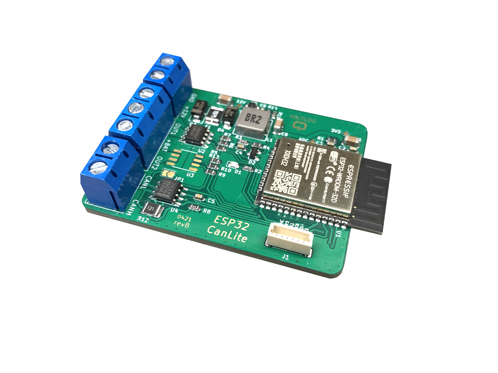

# Voltlog CanLite
This repository contains the source files for the CanLite, an ESP32 based CAN development/hacking board which features a built-in automotive grade dc-dc converter as well as an optional two channel high-side automotive grade switch capable of switching up to 1.8A per channel with plenty of protection features.

More info about this project in [Voltlog #370](https://youtu.be/DLKQcw506ck) & [Voltlog #390](https://youtu.be/DLKQcw506ck).
If you would like to order one of these boards ready assembled, check out my [Tindie store](https://voltlog.com/y/canlite).

### Changelog
- revD: Switched to a different inductor, [different high-side switch](https://www.infineon.com/dgdl/Infineon-BTS452T-DS-v01_01-EN.pdf?fileId=5546d4625a888733015aa9afaf0f35d1), optimised layout.
- revC: Switched to a different inductor pn, added some IO access via test points.
- revB: Fixed some bugs from revA.
- revA: Initial release.

