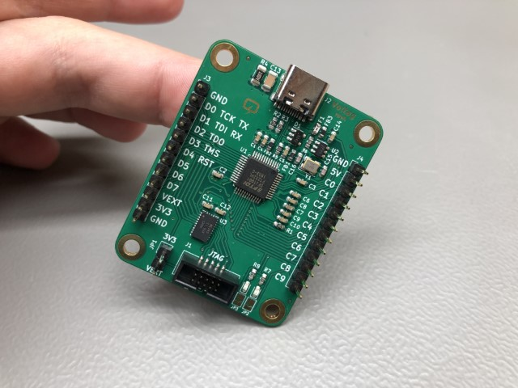

# Voltlog CanLite
This repository contains the source files for the CanLite, an ESP32 based CAN development/hacking board which features a built-in automotive grade dc-dc converter as well as an optional two channel high-side automotive grade switch capable of switching up to 6A per channel with plenty of protection features.

More info about this project in [Voltlog #370](https://youtu.be/LoFzdOF0YcYk).

